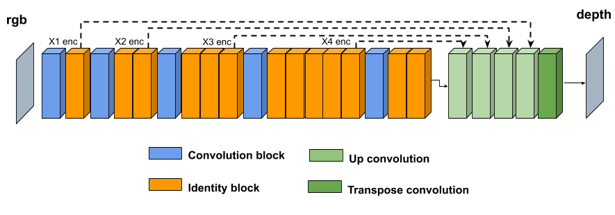
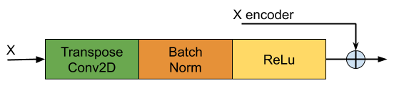
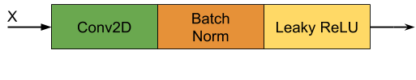
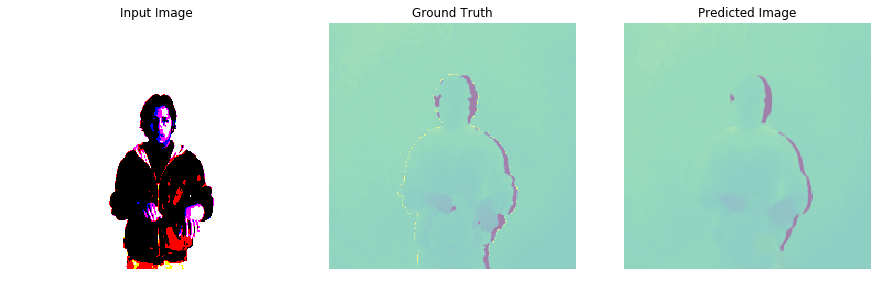
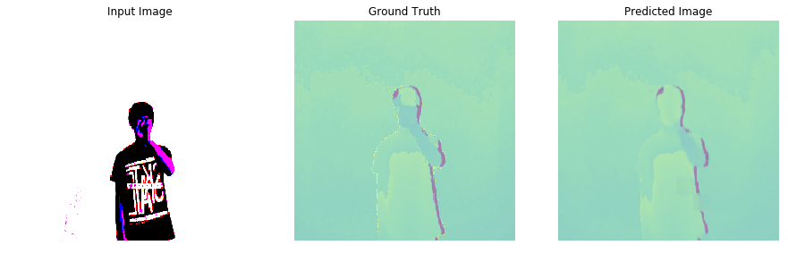
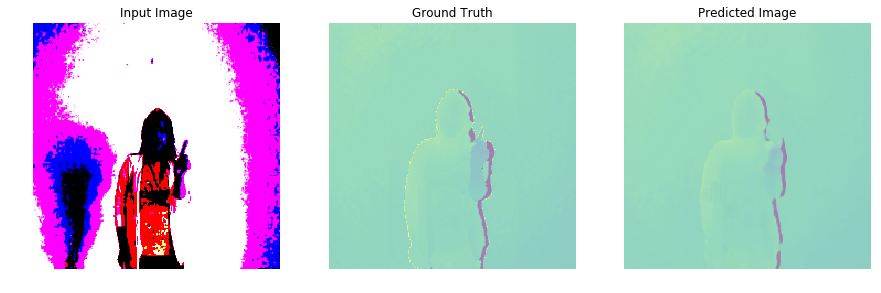

# CGAN: RGB to Depth
El presente trabajo surge como una segunda opcion para remplazar el sensor kinect v1 del siguiente articulo cientifico: https://link.springer.com/chapter/10.1007/978-3-030-46140-9_16 mediante una camara convencional RGB.

In GAN, two models are trained Generative model G and Discriminative model D. The training procedure for G is to maximize the probability of D making a mistake. This framework corresponds to a minimax two-player game.

$$ \underset{G}min \, \underset{D}max \, V(D,G) = \textrm{E}_{x\sim p_{data(x)}[logD(x)]}+\textrm{E}_{z\sim p_{z}(z)[log(1-D(G(Z)))]}$$


<ul>
    <li>
        G and D are both trained simultaneously.
    </li>
    <li>
        Parameters for G are trained to minimize log(1-D(G(z)), and parameters for D are trained to minimize logD(x), following the above two-player min-max game with value function V(D,G).
    </li>
</ul>

## 1) Generator

<h3>
<strong>(Fig.1) Generator:</strong>
</h3> <br>

<div class="row">
  <div class="column" style="width: 100%;  text-align:center">
      <div>
          
      </div>
  </div>
</div> 
<br>
El generador se divide en encoder y decoder, el encoder esta formado por 2 tipos de agrupacion llamados bloques de convolucion e identidad, donde la dimension de la entrada del generaror es de <strong>224x224x3</strong> y su respectiva salida es de dimension <strong>7x7x2048</strong>, la estructura del decoder esta formado por la agrupacion de 4 bloques llamados up convolution, cuya salida se pasa a un transpose convolution con una funcion de activacion <strong>tanh</strong> y asi poder inferir las distancias en una escala de -1 a 1 definida mediante el mapa de colores <a href="https://bids.github.io/colormap/">Viridis</a>. Cada parte del generador se ira detallando a medida que se implementa el codigo. <br>
 Los pesos del modelo entrenado lo pueden encontrar en el siguiente enlace:
<strong>Modelo Entrenado</strong>
<a href="https://drive.google.com/drive/folders/1VCv28BR9kB_KAMYZhrv2sas8PB55r-tx?usp=sharing">Descargar Modelo</a>


```python
#Librerias necesarias
import tensorflow as tf
import numpy as np
import os
import time
import matplotlib.pyplot as plt
from tqdm import tnrange, tqdm_notebook
import PIL
import pickle
from IPython.display import clear_output
from generateBatch import generateHdf5Data
```

<h3>
<strong>(Fig.2) Bloques de identidad y convolucion:</strong>
</h3> <br>
<div id="apDiv1">
<table width="100%" border="0">
<tr>
<td>
  <div class="column1" style="width: 100%;  text-align:center">
    <div>
        
    </div>
    <spam><strong>Identity Block from ResNet50.</strong></spam>
  </div>
</td>
<td>
  <div class="column" style="width: 100%;  text-align:center">
      <div>
          
      </div>
      <spam><strong>Convolutional Block from ResNet50.</strong></spam>
  </div>
</td>
</tr>
</table>
</div>
<br>
La estructura de los bloques de convolucion e identidad son desarrolladas tal como se describe en la arquitectura
<a href="https://arxiv.org/abs/1512.03385">ResNet50</a>. Primeramente se desarrolla el bloque de identidad y finalmente el bloque de convolucion.


```python
class identity_block(tf.keras.Model):
    def __init__(self, f, filters, stage, block, **kwargs):
        super(identity_block, self).__init__(**kwargs)
        # defining name basis
        conv_name_base = 'res' + str(stage) + block + '_branch'
        bn_name_base = 'bn' + str(stage) + block + '_branch'

        # Retrieve Filters
        F1, F2, F3 = filters
        
        initializer = tf.compat.v1.initializers.glorot_uniform(seed=0)
        self.conv1 = tf.compat.v1.keras.layers.Conv2D(F1, (1, 1), strides = (1,1), padding = 'valid', name = conv_name_base + '2a', kernel_initializer = initializer)
        self.batch1 = tf.compat.v1.layers.BatchNormalization(axis = 3, name = bn_name_base + '2a')
        
        self.conv2 = tf.compat.v1.keras.layers.Conv2D(F2, (f, f), strides = (1,1), padding = 'same', name = conv_name_base + '2b', kernel_initializer = initializer)
        self.batch2 = tf.compat.v1.layers.BatchNormalization(axis = 3, name = bn_name_base + '2b')
        
        self.conv3 = tf.compat.v1.keras.layers.Conv2D(F3, (1, 1), strides = (1,1), padding = 'valid', name = conv_name_base + '2c', kernel_initializer = initializer)
        self.batch3 = tf.compat.v1.layers.BatchNormalization(axis = 3, name = bn_name_base + '2c')
        
    def call(self, x, training=True):
        X_shortcut = x
        x = self.conv1(x)
        x = self.batch1(x, training=training)
        x = tf.compat.v1.nn.relu(x)
        
        x = self.conv2(x)
        x = self.batch2(x, training=training)
        x = tf.compat.v1.nn.relu(x)
        
        x = self.conv3(x)
        x = self.batch3(x, training=training)
        x = tf.compat.v1.keras.layers.add([x, X_shortcut])
        x = tf.compat.v1.nn.relu(x)
        return x
```


```python
class conv_block(tf.keras.Model):
    def __init__(self, f, filters, stage, block, s = 2, **kwargs):
        super(conv_block, self).__init__(**kwargs)
       # defining name basis
        conv_name_base = 'res' + str(stage) + block + '_branch'
        bn_name_base = 'bn' + str(stage) + block + '_branch'

        # Retrieve Filters
        F1, F2, F3 = filters
        
        initializer = tf.compat.v1.initializers.glorot_uniform(seed=0)
        self.conv1 = tf.compat.v1.keras.layers.Conv2D(F1, (1, 1), strides = (s,s), padding = 'valid', name = conv_name_base + '2a', kernel_initializer = initializer)
        self.batch1 = tf.compat.v1.layers.BatchNormalization(axis = 3, name = bn_name_base + '2a')
        
        self.conv2 = tf.compat.v1.keras.layers.Conv2D(F2, (f, f), strides = (1,1), padding = 'same', name = conv_name_base + '2b', kernel_initializer = initializer)
        self.batch2 = tf.compat.v1.layers.BatchNormalization(axis = 3, name = bn_name_base + '2b')
        
        self.conv3 = tf.compat.v1.keras.layers.Conv2D(F3, (1, 1), strides = (1,1), padding = 'valid', name = conv_name_base + '2c', kernel_initializer = initializer)
        self.batch3 = tf.compat.v1.layers.BatchNormalization(axis = 3, name = bn_name_base + '2c')
        
        self.conv_shortcut = tf.compat.v1.keras.layers.Conv2D(F3, (1, 1), strides = (s,s), padding = 'valid', name = conv_name_base + '1', kernel_initializer = initializer)
        self.batch_shortcut = tf.compat.v1.layers.BatchNormalization(axis = 3, name = bn_name_base + '1')
        
    def call(self, x, training=True):
        x_shortcut = x
        x = self.conv1(x)
        x = self.batch1(x, training=training)
        x = tf.compat.v1.nn.relu(x)
        
        x = self.conv2(x)
        x = self.batch2(x, training=training)
        x = tf.compat.v1.nn.relu(x)
        
        x = self.conv3(x)
        x = self.batch3(x, training=training)
        
        x_shortcut =  self.conv_shortcut(x_shortcut)
        x_shortcut = self.batch_shortcut(x_shortcut, training=training)
        
        x = tf.compat.v1.keras.layers.add([x, x_shortcut])
        x = tf.compat.v1.nn.relu(x)
        return x
```

<h3>
<strong>(Fig.3) Up convolution:</strong>
</h3> <br>
<div class="row">
  <div class="column" style="width: 100%;  text-align:center">
      <div>
          
      </div>
      <spam><strong>Up Convolution</strong></spam>
  </div>
</div> 
<br>
Cada bloque up convolution se desarrolla segun la (Figura.3), donde <strong>X</strong> es la saldida de la anterior capa y <strong>X encoder</strong> son las salidas de cada bloque de identidad del encoder ver (Figura.1).


```python
class Upsample(tf.keras.Model):
    def __init__(self, filters, size, apply_dropout=False):
        super(Upsample, self).__init__()
        self.apply_dropout = apply_dropout
        initializer = tf.compat.v1.initializers.random_normal(0., 0.02)
        self.up_conv = tf.compat.v1.keras.layers.Conv2DTranspose(filters, 
                                                       (size, size), 
                                                       strides=2, 
                                                       padding='same',
                                                       kernel_initializer=initializer,
                                                       use_bias=False)
        self.batchnorm = tf.compat.v1.keras.layers.BatchNormalization()
            

    def call(self, x1, x2, training):
        x = self.up_conv(x1)
        x = self.batchnorm(x, training=training)
        if self.apply_dropout:
            x =self.dropout = tf.compat.v1.nn.dropout(x, rate=0.5)
        x = tf.compat.v1.nn.relu(x)
        x = tf.compat.v1.concat([x, x2], axis=-1)
        return x
```


```python
#Se une toda las partes antes mencionada siguiendo estrictamente la secuencia que se observa en la (Figura.1)
class Generator(tf.keras.Model):
    def __init__(self):
        super(Generator, self).__init__()
        initializer = tf.compat.v1.initializers.glorot_uniform(seed=0)
        
        self.conv0 = conv_block(3, [32, 32, 128], stage=1, block='a')
        self.conv1 = identity_block(3, [32, 32, 128], stage=1, block='b')
        
        self.conv2 = conv_block(3, [64, 64, 256], stage=2, block='a', s=1)
        self.conv3 = identity_block(3, [64, 64, 256], stage=2, block='b')
        self.conv4 = identity_block(3, [64, 64, 256], stage=2, block='c')

        self.conv5 = conv_block(3, [128, 128, 512], stage=3, block='a')
        self.conv6 = identity_block(3, [128, 128, 512], stage=3, block='b')
        self.conv7 = identity_block(3, [128, 128, 512], stage=3, block='c')
        self.conv8 = identity_block(3, [128, 128, 512], stage=3, block='d')

        self.conv9 = conv_block(3, [256, 256, 1024], stage=4, block='a')
        self.conv10 = identity_block(3, [256, 256, 1024], stage=4, block='b')
        self.conv11 = identity_block(3, [256, 256, 1024], stage=4, block='c')
        self.conv12 = identity_block(3, [256, 256, 1024], stage=4, block='d')
        self.conv13 = identity_block(3, [256, 256, 1024], stage=4, block='e')
        self.conv14 = identity_block(3, [256, 256, 1024], stage=4, block='f')

        self.conv15 = conv_block(3, [512, 512, 2048], stage=5, block='a')
        self.conv16 = identity_block(3, [512, 512, 2048], stage=5, block='b')
        self.conv17 = identity_block(3, [512, 512, 2048], stage=5, block='c')
        
        self.up1 = Upsample(2048, 3, apply_dropout=True)
        self.up2 = Upsample(1024, 3, apply_dropout=True)
        self.up3 = Upsample(512, 3, apply_dropout=True)
        self.up4 = Upsample(256, 3)

        self.last = tf.compat.v1.keras.layers.Conv2DTranspose(3, 
                                                    (4, 4), 
                                                    strides=2, 
                                                    padding='same',
                                                    kernel_initializer=initializer) #(transpose Cov)  last layer of the generator (Figura.1)
    
    def call(self, x, training):
        x1 = self.conv0(x) 
        x1 = self.conv1(x1)#(None, 112, 112, 128) 
        
        x2 = self.conv2(x1) 
        x2 = self.conv3(x2)
        x2 = self.conv4(x2)#(None, 56, 56, 256) 
        
        x3 = self.conv5(x2)
        x3 = self.conv6(x3)
        x3 = self.conv7(x3)
        x3 = self.conv8(x3)#(None, 28, 28, 512) 

        x4 = self.conv9(x3)
        x4 = self.conv10(x4)
        x4 = self.conv11(x4)
        x4 = self.conv12(x4)
        x4 = self.conv13(x4)
        x4 = self.conv14(x4)#(None, 14, 14, 1024) 

        x5 = self.conv15(x4)
        x5 = self.conv16(x5)
        x5 = self.conv17(x5)#(None, 7, 7, 2048) Final output from encoder
        
        #SAME PADDING: 
        #Transpose Convolution Size = Input Size * Stride 
        #VALID PADDING: 0
        #Transpose Convolution Size = Input Size * Stride + max(Filter Size - Stride, 0)
        
        x6 = self.up1(x5, x4, training=training) # (None, 14, 14, 4096)
        x7 = self.up2(x6, x3, training=training) # (None, 28, 28, 2048)
        x8 = self.up3(x7, x2, training=training) # (None, 56, 56, 1024)
        x9 = self.up4(x8, x1, training=training) # (None, 112, 112, 512)

        x10 = self.last(x9) # (None, 224, 224, 3)
        x11 = tf.compat.v1.nn.tanh(x10)

        return x11
```

## 2) Discriminator
La estrutura del discriminador es identica como se describe en <a href="https://arxiv.org/pdf/1611.07004.pdf">Image-to-Image Translation with Conditional Adversarial Networks</a>, unicamente se modifico la dimension de la entrada de <strong>256x256x3</strong> a <strong>224x224x224</strong> generando asi una salida de dimencion <strong>batchx26x26x1</strong>.

El discriminador esta compuesto por la siguiente estructura: 
Disc Down sample => ddw <br>
Zero Pad => zp<br>
convolution => cv<br>
batch normalization => bn<br>

Secuencia de capas que forman el discriminador:<br>
ddw=>ddw=>ddw=>zp=>cv=>bn=>Leaky ReLU=>zp=>cv<br>

En la Fig.4 se puede visualizar el bloque Disc Down sample.
<h3>
<strong>(Fig.4) Disc Down sample:</strong>
</h3> <br>
<div class="row">
  <div class="column" style="width: 100%;  text-align:center">
      <div>
          
      </div>
      <spam><strong>Disc Down sample</strong></spam>
  </div>
</div> 
<br>


```python
class DiscDownsample(tf.keras.Model):
    def __init__(self, filters, size, apply_batchnorm=True):
        super(DiscDownsample, self).__init__()
        self.apply_batchnorm = apply_batchnorm
        initializer = tf.compat.v1.initializers.random_normal(0., 0.02)

        self.conv1 = tf.compat.v1.keras.layers.Conv2D(filters, 
                                            (size, size), 
                                            strides=2, 
                                            padding='same',
                                            kernel_initializer=initializer,
                                            use_bias=False)
        if self.apply_batchnorm:
            self.batchnorm = tf.compat.v1.keras.layers.BatchNormalization()
  
    def call(self, x, training):
        x = self.conv1(x)
        if self.apply_batchnorm:
            x = self.batchnorm(x, training=training)
        x = tf.compat.v1.nn.leaky_relu(x)
        return x 
```


```python
class Discriminator(tf.keras.Model):
    def __init__(self):
        super(Discriminator, self).__init__()
        initializer = tf.compat.v1.initializers.random_normal(0., 0.02)

        self.down1 = DiscDownsample(64, 4, False)
        self.down2 = DiscDownsample(128, 4)
        self.down3 = DiscDownsample(256, 4)
        self.zero_pad1 = tf.compat.v1.keras.layers.ZeroPadding2D()
        self.conv =  tf.compat.v1.keras.layers.Conv2D(512, 
                                           (4, 4), 
                                           strides=1, 
                                           kernel_initializer=initializer, 
                                           use_bias=False)
        self.batchnorm1 = tf.compat.v1.keras.layers.BatchNormalization()
        self.zero_pad2 = tf.compat.v1.keras.layers.ZeroPadding2D()
        self.last = tf.compat.v1.keras.layers.Conv2D(1, 
                                           (4, 4), 
                                           strides=1,
                                           kernel_initializer=initializer)
  
    
    def call(self, inp, tar, training):
        # concatenating the input and the target
        x = tf.compat.v1.concat([inp, tar], axis=-1) # (bs, 224, 224, channels*2)
        x = self.down1(x, training=training) # (bs, 112, 112, 64)
        x = self.down2(x, training=training) # (bs, 56, 56, 128)
        x = self.down3(x, training=training) # (bs, 28, 28, 256)

        x = self.zero_pad1(x) # (bs, 30, 30, 256)
        x = self.conv(x)      # (bs, 27, 27, 512)
        x = self.batchnorm1(x, training=training)
        x = tf.compat.v1.nn.leaky_relu(x)

        x = self.zero_pad2(x) # (bs, 29, 29, 512)
        # don't add a sigmoid activation here since
        # the loss function expects raw logits.
        x = self.last(x)      # (bs, 26, 26, 1)

        return x
```

## Discriminator loss


```python
LAMBDA = 100
```


```python
def discriminator_loss(disc_real_output, disc_generated_output):
    real_loss = tf.compat.v1.losses.sigmoid_cross_entropy(multi_class_labels = tf.compat.v1.ones_like(disc_real_output), 
                                              logits = disc_real_output)
    generated_loss = tf.compat.v1.losses.sigmoid_cross_entropy(multi_class_labels = tf.compat.v1.ones_like(disc_generated_output), 
                                                   logits = disc_generated_output)

    total_disc_loss = real_loss + generated_loss

    return total_disc_loss
```

## Generator loss


```python
def generator_loss(disc_generated_output, gen_output, target):
    gan_loss = tf.compat.v1.losses.sigmoid_cross_entropy(multi_class_labels = tf.compat.v1.ones_like(disc_generated_output),
                                             logits = disc_generated_output) 
    # mean absolute error
    l1_loss = tf.compat.v1.math.reduce_mean(tf.compat.v1.math.abs(target - gen_output))

    total_gen_loss = gan_loss + (LAMBDA * l1_loss)

    return total_gen_loss
```

# Modulos para el entrenamiento


```python
#Modulo para visualizar el comportamiento del modelo en nuestro dataset de prueba
def generate_images(model, test_input, tar):
  # the training=True is intentional here since
  # we want the batch statistics while running the model
  # on the test dataset. If we use training=False, we will get 
  # the accumulated statistics learned from the training dataset
  # (which we don't want)
    prediction = model(test_input, training=False)
    plt.figure(figsize=(15,15))

    display_list = [test_input[0], tar[0], prediction[0]]
    title = ['Input Image', 'Ground Truth', 'Predicted Image']

    for i in range(3):
        plt.subplot(1, 3, i+1)
        plt.title(title[i])
        # getting the pixel values between [0, 1] to plot it.
        plt.imshow(display_list[i] * 0.5 + 0.5)
        plt.axis('off')
    plt.show()
```


```python
def train(dataset, generator, discriminator, generator_optimizer, discriminator_optimizer):
    gen_loss = 0
    disc_loss = 0
    for input_image, target in tqdm_notebook(dataset, total=None, desc="Train"):
        with tf.compat.v1.GradientTape() as gen_tape, tf.compat.v1.GradientTape() as disc_tape:
            gen_output = generator(input_image, training=True)

            disc_real_output = discriminator(input_image, target, training=True)
            disc_generated_output = discriminator(input_image, gen_output, training=True)

            gen_loss = generator_loss(disc_generated_output, gen_output, target)
            disc_loss = discriminator_loss(disc_real_output, disc_generated_output)

        generator_gradients = gen_tape.gradient(gen_loss, 
                                                  generator.variables)
        discriminator_gradients = disc_tape.gradient(disc_loss, 
                                                       discriminator.variables)

        generator_optimizer.apply_gradients(zip(generator_gradients, 
                                                  generator.variables))
        discriminator_optimizer.apply_gradients(zip(discriminator_gradients, 
                                                      discriminator.variables))
    return [gen_loss, disc_loss]
```


```python
def val(dataset, generator, discriminator):
    gen_loss = 0
    disc_loss = 0
    length = 0
    for input_image, target in tqdm_notebook(dataset, total=None, desc="Dev"):
        with tf.compat.v1.GradientTape() as gen_tape, tf.compat.v1.GradientTape() as disc_tape:
            gen_output = generator(input_image, training=False)

            disc_real_output = discriminator(input_image, target, training=False)
            disc_generated_output = discriminator(input_image, gen_output, training=False)

            gen_loss += generator_loss(disc_generated_output, gen_output, target)
            disc_loss += discriminator_loss(disc_real_output, disc_generated_output)
            length += input_image.shape[0]

    return [gen_loss/length, disc_loss/length]
```


```python
def train_model(dataset_train, dataset_val, epochs, generator, discriminator, generator_optimizer, discriminator_optimizer, verbose=1, show=0, early_stop=0):
    train_loss = {}
    val_loss = {}
    best_val_loss, best_val_epoch = None, None
    
    for epoch in tnrange(epochs, desc="Epoch: "):
        start = time.time()
        data = generateHdf5Data(dataset_train, 4)
        train_loss[epoch] = train(data, generator, discriminator, generator_optimizer, discriminator_optimizer)
        data = generateHdf5Data(dataset_val, 4)
        val_loss[epoch] = val(data, generator, discriminator)
        if verbose == 1:                  
            print ('Time taken for epoch {0} is {1:.3f} sec, train_lossG is {2:.4f},train_lossD is {3:.4f}, val_lossG is {4:.4f}, val_lossD is {5:.4f} \n'.format((epoch +1) ,
                                                               time.time()-start, train_loss[epoch][0],train_loss[epoch][1],
                                                               val_loss[epoch][0], val_loss[epoch][1]))
        if (epoch +1) % show == 0:
            checkpoint_manager.save()
            with open('training_checkpoints/train_{0}.pickle'.format(epoch+1), 'wb') as file_pi:
                pickle.dump(train_loss, file_pi, protocol=pickle.HIGHEST_PROTOCOL)
            with open('training_checkpoints/val_{0}.pickle'.format(epoch+1), 'wb') as file_pi:
                pickle.dump(val_loss, file_pi, protocol=pickle.HIGHEST_PROTOCOL)
                              
        if show != 0:
            if (epoch +1) % show == 0:
                clear_output(wait=True)
                data = generateHdf5Data("test", 1)
                for i,[input_image, target] in enumerate(data):
                    generate_images(generator, input_image, target)
                    if i==10:
                        break
        '''if early_stop!=0:
            if best_val_loss is None or best_val_loss > val_loss[epoch][1]:
                best_val_loss, best_val_epoch = val_loss[epoch][1], epoch
            if best_val_epoch <= epoch - early_stop:
                break'''
    return train_loss, val_loss
```


```python
dataset_train="train"
dataset_test="dev"
epochs = 200
generator = Generator()
discriminator = Discriminator()
generator_optimizer = tf.compat.v1.train.AdamOptimizer(2e-4, beta1=0.5)
discriminator_optimizer = tf.compat.v1.train.AdamOptimizer(2e-4, beta1=0.5)
verbose = 1
show = 10
early_stop = 10
checkpoint_dir = './training_checkpoints'
checkpoint_prefix = os.path.join(checkpoint_dir, "ckpt")
checkpoint = tf.compat.v1.train.Checkpoint(generator_optimizer=generator_optimizer,
                                 discriminator_optimizer=discriminator_optimizer,
                                 generator=generator,
                                 discriminator=discriminator)
checkpoint_manager = tf.compat.v1.train.CheckpointManager(checkpoint, checkpoint_prefix, max_to_keep=5)
```


```python
train_loss, val_loss = train_model(dataset_train, 
                   dataset_test, 
                   epochs, 
                   generator, 
                   discriminator, 
                   generator_optimizer, 
                   discriminator_optimizer, 
                   verbose, show=show, early_stop=early_stop)
```

# Pruebas
Antes de ejecutar las siguientes instrucciones, ejecutar todo los modulos del generador y la funcion "generate_images".


```python
#Instrucciones para restaurar el generador con sus pesos entrenados
generator = Generator()
checkpoint_dir = './training_checkpoints'
checkpoint_prefix = os.path.join(checkpoint_dir, "ckpt")
g = tf.compat.v1.train.Checkpoint(generator=generator)
status = g.restore(tf.compat.v1.train.latest_checkpoint(checkpoint_prefix))
```


```python
data = generateHdf5Data("test", 1)
for i,[input_image, target] in enumerate(data):
    generate_images(generator, input_image, target)
    if i==10:
        break
```

<h3>
<strong>Pruebas:</strong>
</h3> <br>

<div class="row">
  <div class="column" style="width: 100%;  text-align:center">
      <div>
          
      </div>
  </div>
    <div class="column" style="width: 100%;  text-align:center">
      <div>
          
      </div>
  </div>
    <div class="column" style="width: 100%;  text-align:center">
      <div>
          
      </div>
  </div>
</div> 
<br>

# Autor
Yuri vladimir huallpa vargas    yurihuallpavargas@gmail.com


```python

```
